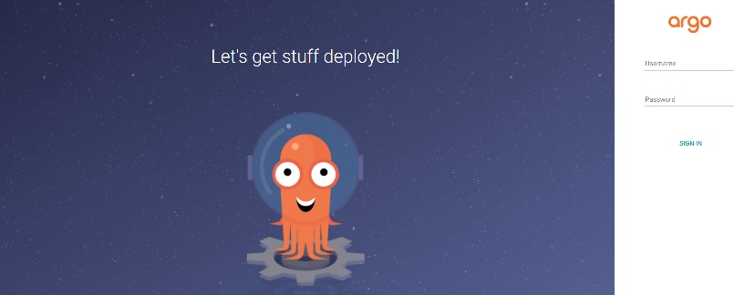

# ArgoCD

以下の手順で導入する。

- ArgoCDのインストール
- CLIの導入
- ArgoCDプロジェクトの作成（プロジェクトごとの権限管理）
- ConfigMapの作成（ArgoCDがアクセスするGithubリポジトリの登録）
- 管理画面へアクセス
- アプリケーションデプロイ用マニフェストの作成
- [App of Apps](https://argo-cd.readthedocs.io/en/stable/operator-manual/declarative-setup/#app-of-apps) （kustomize版）

※App of Appsは必要に応じて利用する

公式ドキュメントは[こちら](https://argoproj.github.io/argo-cd/)  
公式リポジトリは[こちら](https://github.com/argoproj/argo-cd)

## ArgoCDのインストール

公式サイトのstable版をそのまま導入する。そのためnautibleリポジトリにはYAMLファイルは置かず、公式のYAMLファイルを直接参照して導入する。

```bash
kubectl create namespace argocd
kubectl apply -n argocd -f https://raw.githubusercontent.com/argoproj/argo-cd/stable/manifests/install.yaml
```

[インストールドキュメント](https://argoproj.github.io/argo-cd/getting_started/#1-install-argo-cd)

## CLIの導入

[公式サイトの導入手順](ArgoCDのインストール)に従い、CLIを導入する。

## ArgoCDプロジェクトの作成

ArgoCDではアプリケーションのデプロイ権限を切り分ける手段としてプロジェクトという単位を提供している。  
プロジェクト単位で利用可能なソースリポジトリやデプロイ可能なクラスタ、namespeceなどを定義することで、アプリケーションが想定外のデプロイを行わないように制御する。

nautibleではデフォルトのプロジェクト以外にアプリケーション用のプロジェクトとして「application」を作成する。

```bash
kubectl apply -f ci_cd/application-project.yaml
```

### applicationプロジェクトの設定内容

|項目|設定値|
|:--|:--|
|ソース|全許可|
|デプロイ先|自クラスタのnautible-app-msネームスペース|
|クラスタスコープのリソース作成|Namespaceの作成のみ許可|
|ネームスペーススコープのリソース作成|ResourceQuota、LimitRange、NetworkPolicyの作成のみ不可|
|ロール|applicationプロジェクトにあるapp-roleに対し、applicationプロジェクトへの全操作許可|

[公式ドキュメントはこちら](https://argo-cd.readthedocs.io/en/stable/operator-manual/project.yaml)

## ConfigMap

ArgoCDがアクセスするGitリポジトリをConfigMapに登録する。

argocd-cm.yamlはデフォルトではnautibleのリポジトリが指定されているので、適宜リポジトリのURLを変更の上、ConfigMapに反映する。

```bash
kubectl apply -f ci_cd/argocd-cm.yaml
```

[公式ドキュメントはこちら](https://argo-cd.readthedocs.io/en/stable/operator-manual/argocd-cm.yaml)

## 管理画面へのログイン

### ポートフォワードでのログイン

```bash
kubectl port-forward svc/argocd-server -n argocd 8443:443
```

ブラウザで`https://localhost:8443`にアクセス



### 初期アカウント

Usrename : admin  
Password : 以下のsecretに記載（Windowsはbase64コマンドがないため、パイプ「|」以降は書かずにエンコード文字列を出力して他の方法でデコード ※WSLであればそのまま実行可）

```bash
kubectl -n argocd get secret argocd-initial-admin-secret -o jsonpath="{.data.password}" | base64 -d
```

ログイン後、パスワードは変更しておく。

### （参考）エンドポイントの公開方法

ArgoCDへはポートフォワード、ServiceをLoadBalancerにする、Ingressを使用する、のいずれかでアクセス可能  
（外部NWからArgoCDの管理画面へ直接の接続を許容しない場合はポートフォワードにしておく、接続を許容する場合はService（LoadBalancer）、Ingressを使用するなどの選択肢がある）


## アプリケーション導入設定

ArgoCDによるGitOpsを実現するにはArgoCDのカスタムリソースであるApplicationを作成する。  
Applicationリソースでは基本的に下記の３つを設定する。

- 導入元（リポジトリパス）
- 導入先（Kubernetesおよびnamespace）
- 同期ポリシー（自動か手動かなど）

マニフェストのサンプルはnautible-pluginのマニフェスト[(例)cluster-autoscaler](https://github.com/nautible/nautible-plugin/blob/main/cluster-autoscaler/application.yaml)を参照。

[公式ドキュメントはこちら](https://argo-cd.readthedocs.io/en/stable/operator-manual/declarative-setup/)（Applicationリソースはapplication.yamlに記載）

## App of Apps

Applicationリソースを導入した場合、sourceに指定したリポジトリ内で変更が発生した際に差分検知を行うが、Applicationリソース自体の変更を検知したいケース（targetRevisionの変更を検知したいなど）や複数のApplicationリソースのライフサイクルをまとめて管理したいケースなどがある。

そのような場合、App of Appsパターンでの導入が有効となる。

App of Appsパターンでの導入サンプルは[nautible-pluginのマイクロサービスアプリケーションの導入マニフェスト](https://github.com/nautible/nautible-plugin/blob/main/app-ms/overlays/aws/application.yaml)を参照。

## Githubのリポジトリがプライベートリポジトリの場合

Githubがプライベートリポジトリの場合はArgoCDからアクセスする際にユーザーIDとトークンが必要になる。nautibleではシークレットはExternalSecrets経由で取得する仕組みとしているため、下記のようにユーザIDとトークンを用意し、Githubアクセス時の認証に使用する。

### ExternalSecrets

ExternalSecretsをデプロイ

事前にSecretsManager（AWSの場合）、AzureKeyVault（Azureの場合）にシークレットを定義しておく

AWS（SecretsManager）の例

```yaml
apiVersion: 'kubernetes-client.io/v1'
kind: ExternalSecret
metadata:
  name: secret-github
  namespace: argocd
spec:
  backendType: secretsManager
  data:
    - key: nautible-infra-github-user   # SystemManager key
      name: github-user                 # Deployment name
    - key: nautible-infra-github-token  # SystemManager key
      name: github-token                # Deployment name
```

Azureの例

```yaml
apiVersion: 'kubernetes-client.io/v1'
kind: ExternalSecret
metadata:
  name: secret-github
  namespace: argocd
spec:
  backendType: azureKeyVault
  keyVaultName: nautibledevkeyvault
  data:
    - key: nautible-infra-github-user   # SystemManager key
      name: github-user                   # Deployment name
    - key: nautible-infra-github-token  # SystemManager key
      name: github-token                  # Deployment name
```

### シークレットの作成

[nautible-pluginのsecrets](https://github.com/nautible/nautible-plugin/tree/main/secrets)ドキュメントに従いSecretおよびExternalSecretsのリソースを作成する。

### ConfigMap

argocd-cm.yamlを修正し、リポジトリへアクセスするためのユーザ名、シークレットを追記する。

```yaml
    - url: https://github.com/nautible/nautible-app-customer-manifest
      name: nautible-app-customer-manifest
+     passwordSecret:
+       name: secret-github
+       key: github-token
+     usernameSecret:
+       name: secret-github
+       key: github-user
```

※ 上記設定をすべてのプライベートリポジトリに追加する

## アップグレード

＜version＞ 部分にアップグレードしたいバージョンを入れて実行

```bash
kubectl apply -n argocd -f https://raw.githubusercontent.com/argoproj/argo-cd/<version>/manifests/install.yaml
```

例）

```bash
kubectl apply -n argocd -f https://raw.githubusercontent.com/argoproj/argo-cd/v2.1.4/manifests/install.yaml
```
